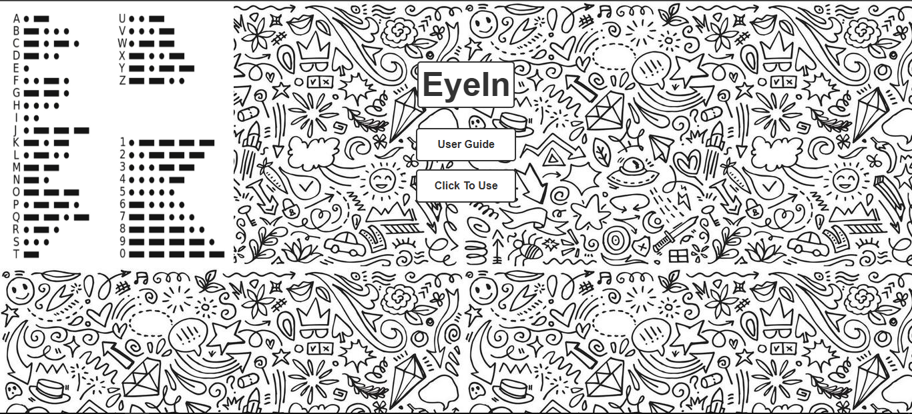
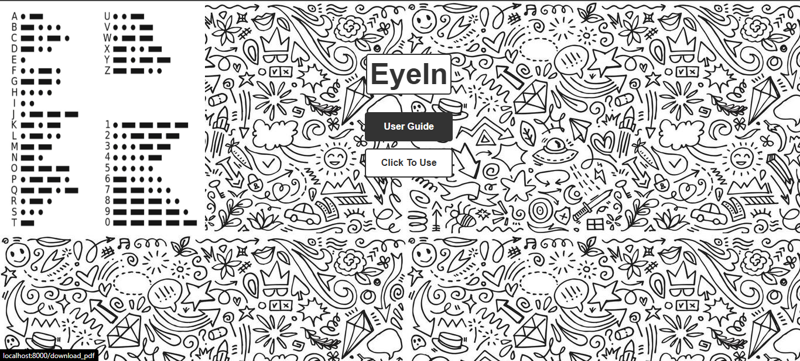
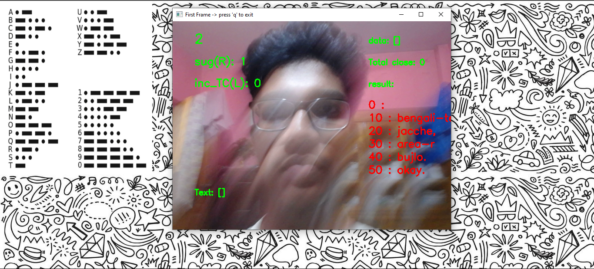
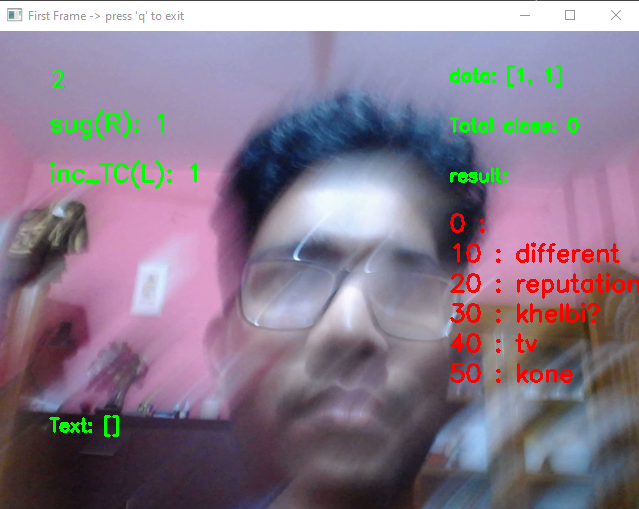
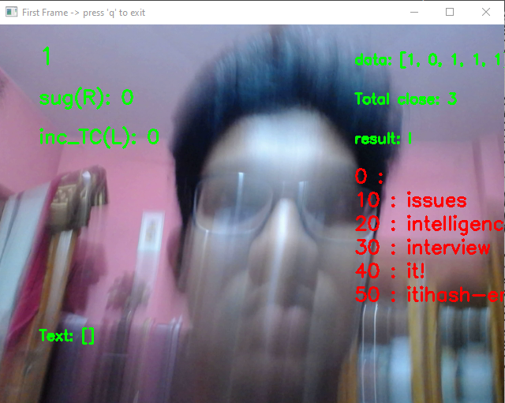
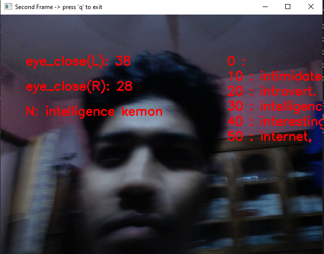
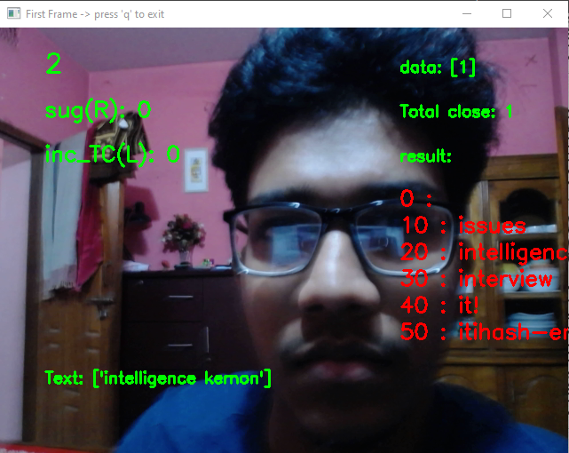

# EyeIn

Communication for individuals with Locked-In Syndrome (LIS)—a condition where a person is conscious but cannot move or speak due to paralysis—faces several disadvantages despite advancements in assistive technologies. Effective communication often requires specialized devices that may be expensive, fragile, or unavailable in certain environments (e.g., during power outages or travel). Communication usually involves third-party, which can compromise privacy and autonomy.
To address these challenges, I developed a communication system for individuals with Locked-In Syndrome that uses blinking-based Morse code input combined with text suggestions and next-word prediction to significantly speed up and simplify communication. This solution enhances autonomy, reduces reliance on third parties, and allows users to convey complex thoughts more efficiently without the need for expensive hardware.

 

The front page of the application features two primary buttons: one labeled “User Guide” which provides detailed instructions on how to use the system, and another labeled “Click To Use” which launches the communication interface for users to begin interacting with the system.

 

When the user clicks the “User Guide” button, a PDF file is downloaded. This document contains comprehensive instructions on how the application works and how it should be used effectively.

 

If the user clicks “Click To Use” the application will access the webcam (Preferred to have a webcam) allowing the user to interact with the system and communicate using the blinking-based interface.
 

After a few seconds, the application will access the webcam and begin receiving input from the user, enabling real-time interaction through the blinking-based communication system.

## HOW TO USE THE APPLICATION
if eye closed then morse code = 0 else 1 (use your right eye to do this) 

এখানে সবার ডানে উপরে হচ্ছে সময় যা ২ সেকেন্ড পর্যন্ত গুনতে থাকবে । তার নিচে হচ্ছে “sug(R)” টেক্সট সাজেশন নেওয়ার জন্য ব্যাবহার করা হয়। তার নিচে হচ্ছে “inc_TC(L)”যেই মোর্স কোড টা আসছে তা ওয়ার্ড এ রুপ দেওয়ার জন্য কনফার্মেশন ভেলু। তার নিচে হছে “Text” অর্থাৎ এখন পর্যন্ত যা যা ওয়ার্ড বলা হেয়েছে 

সবার বামে “data” অর্থাৎ মোর্স কোড। তার নিচে হচ্ছে  “Total Close”  এটার মান একটা নির্দিষ্ট সংখ্যায় (2 এর উপরে) পৌঁছাইলে এটা একটিভেট হয়। এরপরে হচ্ছে “result”এখানে মোর্স কোড এর সাহায্যে তৈরি ওয়ার্ড দেখা যায়। তার নিচে হচ্ছে টেক্সট সাজেশন যা বর্তমান অক্ষর এর উপর ভিত্তি করে কি ওয়ার্ড হতে পারে তা সাজেসট করে 

	“sug(R)” এর ভেলু যদি ২০ এর উপরে যায় তাহলে এটি অন্য আরেকটি ফ্রেমে যাবে সেখানে ওয়ার্ড কনফারমেশনসহ নেক্সট ওয়ার্ড প্রেডিকশন করা যাবে । যদি ডান চোখ বন্ধ থাকে তাহলে এটির ভেলু বারতে থাকবে 

	“Inc_TC(L)” এটি যদি ৫ হয় তাহলে “Total close” ১ হবে Total close যদি 2 এর উপরে হয় তাহলে“data” তে যা  মোর্স কোড আছে তা ঐ মোর্স কোড অনুযায়ী ওয়ার্ড এ কনভার্ট হবে (খেয়াল রাখতে হবে ৫ হলে যেন চোখ খোলে তা না হলে এটির ভেলু বারতে থাকবে এবং যদি ২০ হয়ে যায় বা ২০ পার হয়ে যায় তাহলে “result”  এ থাকা শেষের অক্ষর টা মুছে যাবে)

 

 
“sug(R)” এর ভেলু যদি ২০ এর উপরে যায় তাহলে এটি আসবে

এই ফেমের মাধমেই আমরা আমদের যেই ওয়ার্ড বা অক্ষর বলতে চাই তা কনফার্ম করতে পারব তো, এখানে যে শুধু টেক্সট সাজেশন বা নেক্সট ওয়ার্ড প্রেডিকশন এর জন্য আসা লাগবে এমনটা না।

	আমরা যদি আমাদের কাছে বা  “result” যা আছে তাই শুধু বের করতে চাই বা “Text” এ add করতে চাই তাহলে আমরা “eye_close(L)”  এর ভেলু ০-৯ এর মধ্যে নিয়ে আসবো(এই রেঞ্জের যেকোনো সংখ্যা হলেই হল) এর পরে “eye_close(R)”  এর ভেলু ১০-১৫ এর মধ্যে নিতে হবে। তখন দুইটা ওয়ার্ড আসবে একটা আমাদের “result” এর অক্ষরটা আরেকটা যেটা সেটা হচ্ছে নেক্সট ওয়ার্ড প্রেডিকশন। এখন আমরা যদি “eye_close(L)”   ও“eye_close(R)”  এই দুইটার ভেলু ২০-২৫ এর মধ্যে নিয়ে আসি তাহলে আমরা আমাদের প্রথম ফ্রেমে চলে যাব এবং দেখবো “Text” এ আমাদের “result” এর ভিতর যা ছিল শুধু সেটাই Text  এ আসছে । যদি নেক্সট ওয়ার্ড প্রেডিকশন এর ভেলু টাও নিতে চাই তাহলে “eye_close(L)”   ও“eye_close(R)”  এই দুইটার ভেলু ৪০-৪৫ এর মধ্যে নিয়ে আসতে হবে।

	আমরা যদি বাকি সাজেশন গুল ট্রাই করতে চাই তাহলে আমাদের যা করতে হবে তা হুচ্ছে যেই ওয়ার্ড টা নিতে চাচ্ছি তার পাশের নাম্বার টা eye_close(L) এর ভেলর সমান করা 

যেমনঃ যদি intelligence এই ওয়ার্ড টা নিতে চাই তাহলে আমাদের যা করতে হবে টা হচ্ছে eye_close(L) এর ভেলুটা ৩০-৩৯ এর রেঞ্জে আনতে হবে। এর পরে eye_close(R) এর ভেলুটা ১০ এর উপরে আনতে হবে। আরেকটা কথা eye_close(L) এর ভেলু যদি ৫৫ এর উপরে যায় তাহলে এটা রিসেট হবে আবার eye_close(R) ৫৫ তে রিসেট নিবে। তো এখন eye_close(L) এর ভেলু রিসেট করতে হবে এবং এর ভেলু ২০-২৫ এ আনতে হবে এরপর eye_close(R)  এর ভেলুটাও ২০-২৫ আনতে হবে তখন সাথে সাথে আমরা প্রথম ফ্রেমে চলে যাব এবং দেকবো যে Text এ ‘intelligence ওয়ার্ডটা যুক্ত হয়েছে।এরকম করে আমরা আরো ওয়ার্ড যুক্ত করে একটা বাক্য বানাতে পারব 

আর যদি আমরা আমাদের পরের ওয়ার্ড টা অর্থাৎ নেক্সট ওয়ার্ড প্রেডিকশনে যা আছে সেটাও বের করতে চাই টেক্সট সাজেশন এর পাশাপাশি  তাহলে eye_close(L) ও eye_close(R) এই দুইটার ভেলুগুলো ৪০-৪৫ রেঞ্জে আনতে হবে খেয়াল রাখতে হবে এই দুইটার ভেলুগুলো যেন আবার ২০-২৫ এর রেঞ্জে না আসে কারন তা হলে এটা টেক্সট সাজেশন নিয়ে প্রথম ফ্রেমে চলে যাবে। এই ক্ষেত্রে হয় eye_close(L) এর ভেলু টেক্সট সজেশন কনফারমেশন করার পর, এটার ভেলু ৪০-৪৫ এর রেঞ্জে নিয়ে এসে তারপরে eye_close(R)  এর ভেলুটা ৪০-৪৫ এর রেঞ্জে নিয়ে আসা খেয়াল রাখতে হবে eye_close(L) বারানর সময় eye_close(R) ভেলুটা যেন ১০ না থাকে কারন তা হলে এটা eye_close(L) এর ভেলু কনফারম করে নিবে তো পরে দেখা যাবে যে যেই ওয়ার্ডটা নিতে চাছিলাম সেটা নেই “N” <- এখানে।

 

------------------------------------------------------------------------------------------
যদি আমরা আমাদের Text এ সকল ওয়ার্ড মুছে ফেলতে চাই তাহলে আমাদেরকে দুই চোখ বন্ধ করে রাখতে হবে এবং ২ সেকেন্ড বা ১ সেকেন্ড পর সব ওয়ার্ড মুছে যাবে সেই সঙ্গে অ্যাপ্লিকেশানটি বলে উঠবে “open” তখন বুঝতে হবে যে ওয়ার্ড মুছে গেসে এবং আমরা চোখ খুলতে পারি 

আমরা  আপ্লিকেশনটি  ‘q’ চাপ দিয়ে বন্ধ করি 
